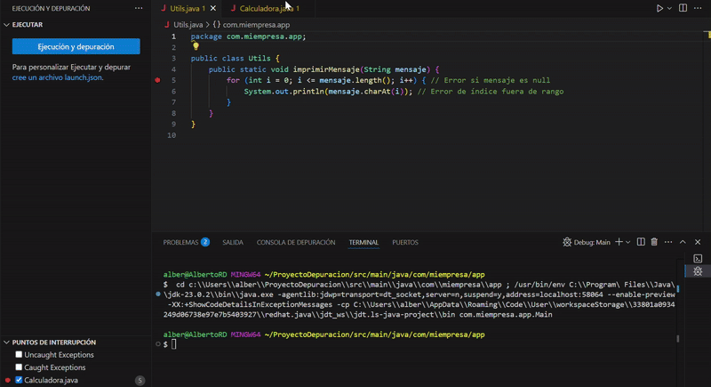
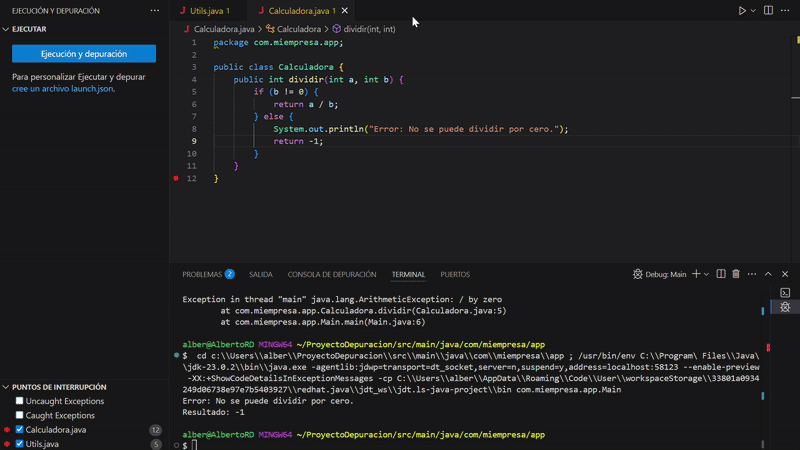
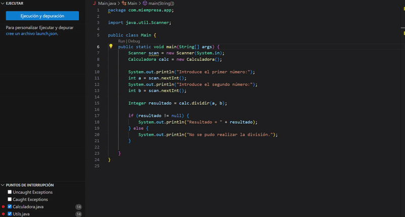

Proyecto de depuración de código.

El objetivo es encontrar los fallor del código mediante depuración y solucionarlos. Se propone el uso de breakpoints, pestaña de variables y pila de llamada.

1. Código erroneo.

Estos codigos tienen errores y es necesario solucionarlo, en las capturas se puede ver el uso de breakpoints en los puntos que pueden ser conflictivos, para llevar a cabo un analisis mediante depuración.

1.1 Ejecutamos la depuración del código para encontrar los fallos

En este GIF se puede observar como al hacer debug la pila de llamadas nos lleva al primer error del código, la posible disivion entre 0 (esto lo sabemos porque en la pestaña de variables b = 0) en el archivo Calculadora.java, para corregirlo escribiremos este código:

    package com.miempresa.app;

    public class Calculadora {

    public Integer dividir(int a, int b) {
        try {
            return a / b;
            } 
        catch (ArithmeticException e) {
            System.out.println("Error: División por cero.");
            return null;
            }
        }
    }

Hemos añadido un If para comprobar que el valor de la variable b es diferente de 0 y en caso en que lo sea lanzar un error.

En este segundo GIF podemos observar como al depurar el código la pila de llamada llama a la siguiente funcion con errores en el código. Encontramos dos errores: 
            
El primero es un error de lógica y ejecucion, y surge en el bucle empleado para leer el resultado. Para solucionarlo cambiamos el '<=' por un '<' en la linea 5 del código, ya que al ser mayor o igual el mansaje.charAt(i)  pretende leer una posición que no existe.

El segundo es de lógica y surge cuando la funcion recoge un 'null'. Para solucionarlo escribiremos este codigo:

    package com.miempresa.app;

    public class Utils {
        public static void imprimirMensaje(String mensaje) {
            if (mensaje != null) {
                for (int i = 0; i < mensaje.length(); i++) {
                    System.out.println(mensaje.charAt(i));
                }
            } else {
                System.out.println("El mensaje es nulo.");
            }
        }
    }

Usamos un If para comprobar que el mensaje sea diferente de 'null' y en caso de que sea igual lanzar un error.

Por último cambiaremos el codigo del main para que sea compatible con todo lo agregado a los archivos Calculadora.java y Utils.java, el codigo usado sera este:
    
    package com.miempresa.app;

    import java.util.Scanner;

    public class Main {
        public static void main(String[] args) {
            Scanner scan = new Scanner(System.in);
            Calculadora calc = new Calculadora();

            System.out.println("Introduce el primer número:");
            int a = scan.nextInt();
            System.out.println("Introduce el segundo número:");
            int b = scan.nextInt();

            Integer resultado = calc.dividir(a, b);

            if (resultado != null) {
                System.out.println("Resultado = " + resultado);
            } else {
                System.out.println("No se pudo realizar la división.");
            }
        }
    }
 
Hemos añadido un scanner para hacer la calculadora mas funcional, pero si probramos cualquier división estre cero ahora si funciona correctamente lanzando un error como se muestra en este GIF:

 

Conclusión: La depuración nos ayuda a encontrar y solucionar problemas.

    Problemas detectados:
        1. División por cero en Calculadora.java:
            Si el divisor es 0, se lanzaba una excepción ArithmeticException que no estaba controlada.
        
        2. Manejo incorrecto del resultado en Main.java:
            Al actualizar las funciones dejaban de ser compatibles con el Main.

        3. Bucle incorrecto en Utils.java:
            El bucle intentaba acceder a una posición fuera de rango en el String (i <= mensaje.length()).
            No se controlaba si mensaje era null.

    Cambios realizados:
        1. En Calculadora.java:
            Ahora devuelve Integer en lugar de int para poder devolver null en caso de error.
            Se añadió un bloque try-catch para capturar la división por cero y devolver null cuando ocurra.

        2. En Main.java:
            Se añadió una comprobación para verificar si resultado es null antes de imprimirlo.
            Se agregó una llamada a Utils.imprimirMensaje() para imprimir un mensaje final.

        3. En Utils.java:
            Se corrigió el bucle cambiando i <= mensaje.length() por i < mensaje.length().
            Se añadió una verificación para evitar imprimir caracteres de un mensaje null.  