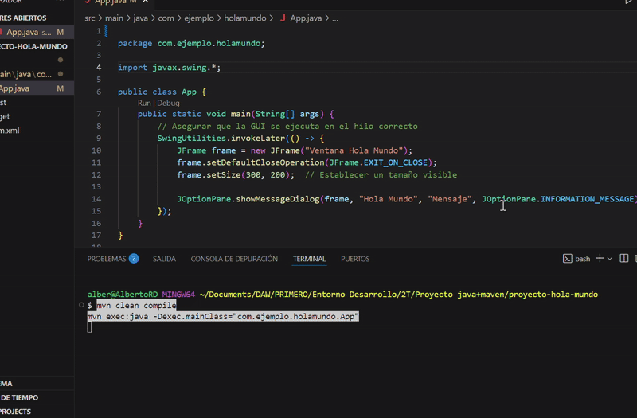

# Proyecto Hola Mundo - Java + Maven + VSCode

Este es un proyecto de ejemplo para aprender a configurar un entorno de desarrollo con Java, Maven y Visual Studio Code. 

## 🚀 Instrucciones de Instalación y Ejecución

### 📌 Requisitos Previos
- Tener instalado **JDK 23** → [Descargar](https://openjdk.org/)
- Tener instalado **Maven** → [Descargar](https://maven.apache.org/)
- Tener **Visual Studio Code** con las extensiones:
  - Java Extension Pack
  - Language Support for Java by Red Hat
  - Debugger for Java
- Configurar las variables de entorno:
  - `JAVA_HOME`
  - `MAVEN_HOME`

### 🛠️ Pasos para ejecutar el proyecto

1. **Clonar el repositorio**  
   ```bash
   git clone https://github.com/tuusuario/proyecto-hola-mundo.git
   cd proyecto-hola-mundo

2. **GIF de como debe funcionar**

